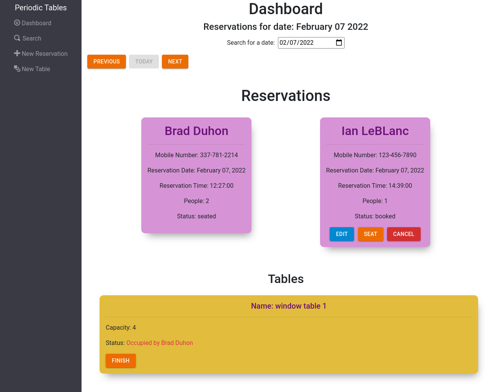
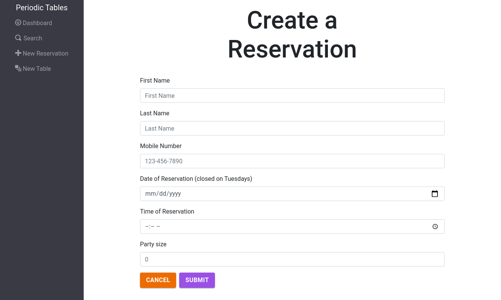
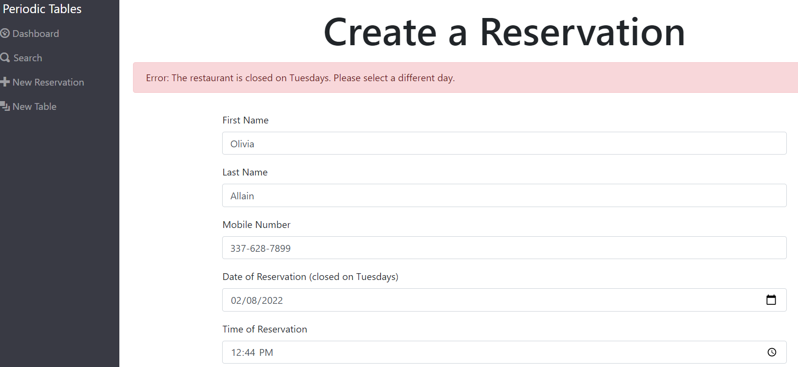
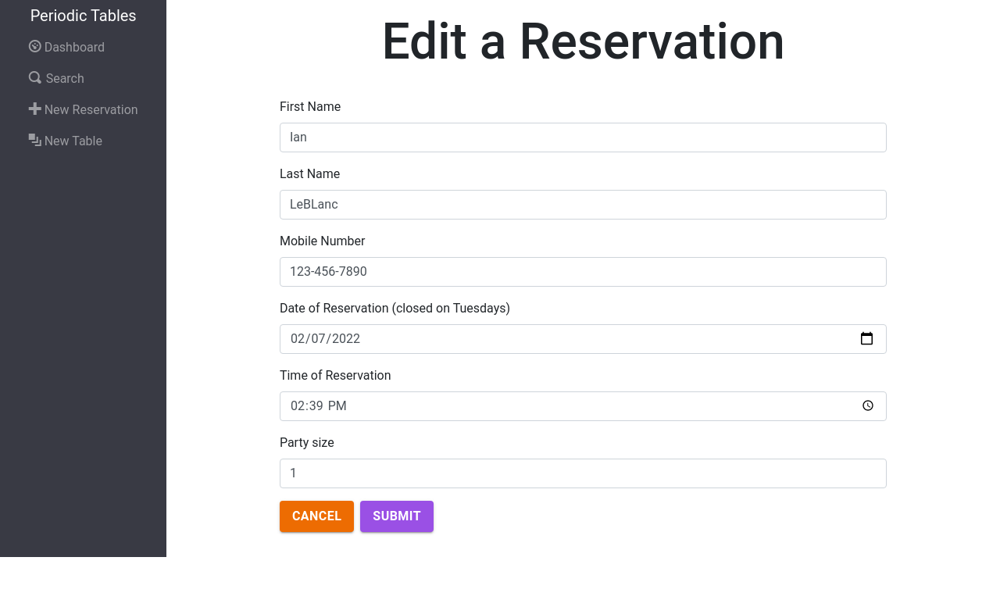
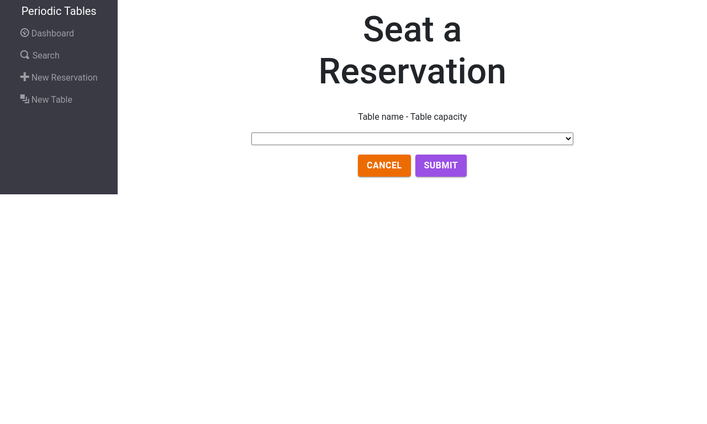
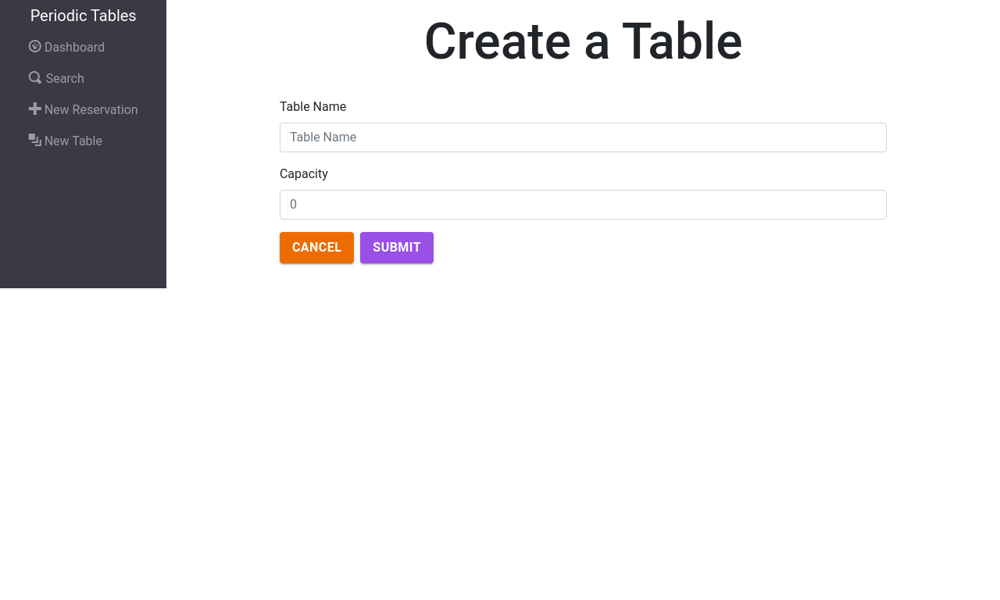
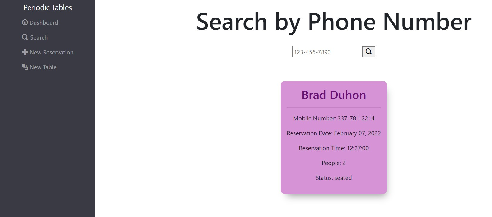

# Periodic Tables Restraunt Reservation

> This app is a Reservation System for fine dining restaurants. The software is used only by restaurant personnel when a customer calls to request a reservation. At this point, the customers will not access the system online.

## Link
[Periodic Tables Restraunt App](https://pho-time-restraunt.herokuapp.com)

### Dashboard Preview

> Dashboard displays reservations on given day. You may seat, edit, or cancel a reservation

### Creat Reservation

### Error Display

> Erros will be displayed on every page if the user inputs incorrect information with a description of said error.

### Edit Reservation

### Create Seat

### Create Table

### Search by mobile-number

## Built With
* Postgres, for the backend data base

* Express, as the backend api
  * Structure backend routes
  * Structure and reuse controller functions for http requests
* Knex, to create Postgres queries into JavaScript
  * create seed files 
  * create service files to database tasks
  * create migration files 
* Cors, to authorize the frontend origin with access to the backend
* React, including Router and Hooks
  * Created with create-react-app
  * Reduce api calls with useEffects and useStates 
* Bootstrap 
* Mui
  * Out of the box React components used to style buttons
* Heroku
  * Migrated the backend and frontend to Heroku 

